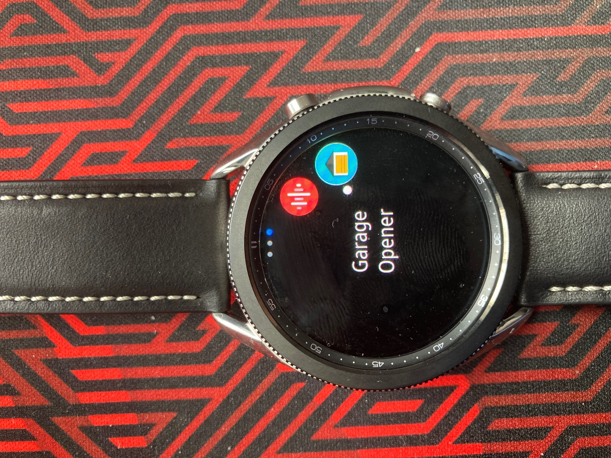
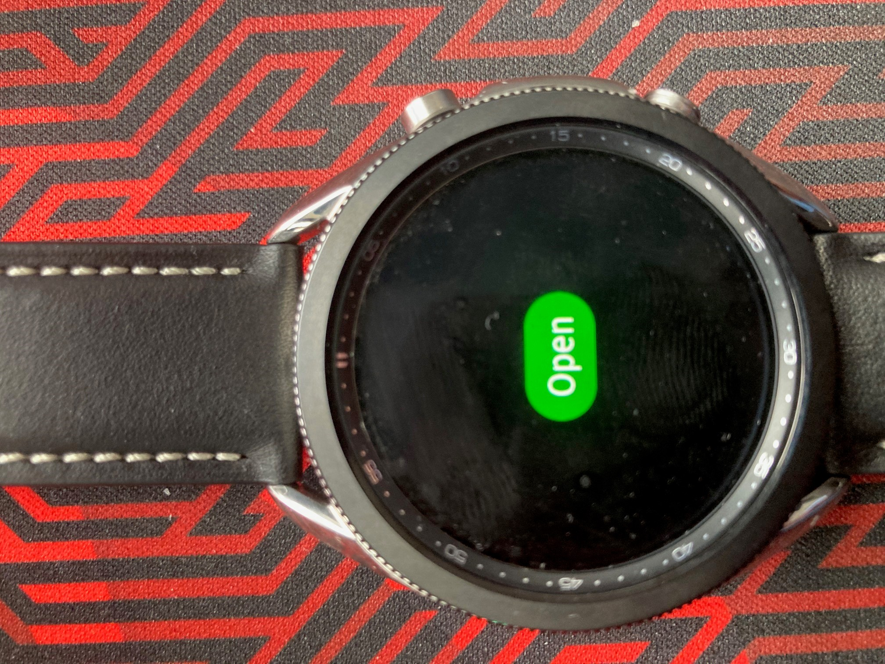
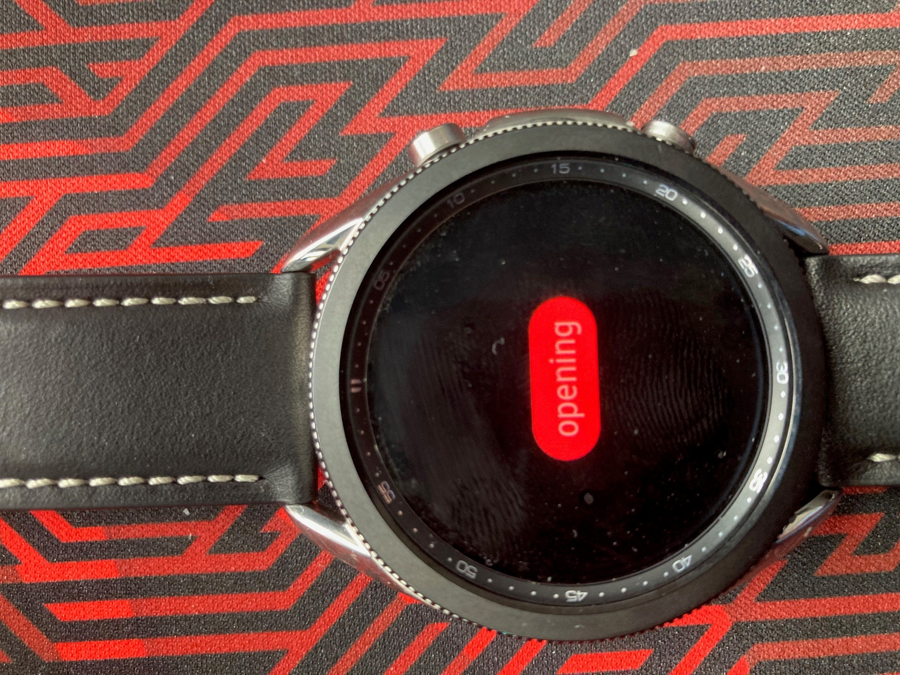

# Samsung Galaxy Watch3 MyQ Garage door opener

### Simple app to open and close a MyQ Garage.

## How to use 
- Setup Tizen with Visual Studio: https://developer.samsung.com/galaxy-watch-develop/creating-your-first-app/setup-sdk.html
- Setup Certificates https://docs.tizen.org/application/dotnet/tutorials/certificates/creating-certificates/
- Setup to debug Watch: https://samsung.github.io/Tizen.CircularUI/guide/TestingYourAppOnGear.html
- Open Constants.cs file and place your MyQ email and password there so it always logins on start.

## Demo

## Todo List

- Allow persistent login rather than hardcoding in the code.
- Better way to keep track of garage state rather than scheduling an api call.
